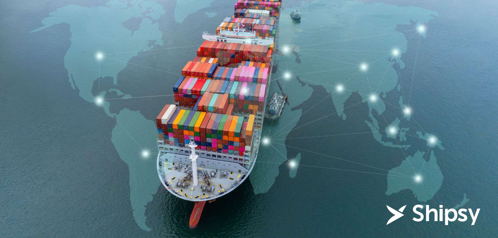

# 🌊 Maritime Veseel Route Simulation and AIS Data Engineering 🚢

## Overview



This project simulates realistic vessel routes between two global ports and streams AIS(Automatic Identification System) messages over Websocket. It includes a complete AIS data engineering pipeline - from simulation to ingestion, validation and analytics.
Designed for a real - world maritime applications, it showcases vessel tracking, data quality handling, and time-series analytics using modern Python Libraries.

---

## Features

- 🔄 ** Route Generation ** Realistic vessel paths between ports using 'searoute-py'.
- 🛰️ ** AIS Simulation ** Position reports at 5-minute intervals using 'py-ais'.
- 🌐 ** WebSocket Streaming ** Real time playback at adjustable speeds.
- 💾 ** Database Ingestion ** Stores AIS data in SQLite with deduplication and validation.
- 🧮 ** Query Analytics ** Calculate vessel distance, speed and trajectories.

## 🛠️ Tech Stack

- **Language**: Python 3
- **Libraries**: `searoute-py`, `pyais`, `shapely`, `geopy`, `websockets`
- **Database**: SQLite (easy migration to PostgreSQL supported)
- **Tools**: WebSocket, Pandas, SQL

## Project Structure

````bash
.
├── data/
│   └── UpdatedPub150.csv                # Port data with lat/lon
├── scripts/
│   ├── route_generator.py       # Generate vessel route using searoute
│   ├── simulator.py            # AIS message simulation + encoding
│   ├── websocket_server.py     # WebSocket message broadcaster
│   ├── ais_ingest1.py          # Ingestion client & database writer
│   └── queries.py              # Query engine for track and stats
├── database/
│   └── new_ais_data.db
├── map_vessel_track.py
│   └── vessel_track1_123456789.html  
├── tests/
│   └── test_parser.py         # Unit/integration tests
├── README.md
└── requirements.txt
````
⚙️ Getting Started

1️. Install dependencies
````bash
pip install -r requirements.txt 
````
2. Generate a route
````bash
python route_generator.py --ports data/UpdatedPub150.csv --output route_output.json
````
3. AIS Simulation
````bash
python simulator.py
````
4. Start WebSocket server
````bash
python websocker_server.py
````
5. Ingest Data into SQLite
````bash
python ais_ingest1.py --db new_ais_data.db
````
6. Run Queries
````bash
python queries.py --mmsi 123456789 --start 2025-01-01 --end 2025-01-02

````

  ### 🗃️ Database Schema
````bash
  CREATE TABLE ais_messages (
    mmsi TEXT, 
    timestamp DATETIME, 
    lat FLOAT, 
    lon FLOAT, 
    speed FLOAT, 
    course FLOAT, 
    payload TEXT, 
    PRIMARY KEY (mmsi, timestamp)
);
 
````

## 📊Sample Queries

Get Full Vessel Track by MMSI and time range.
Compute Total Distance & Average Speed.
Detect Missing or Out-of-Order AIS Reports.

## 🎯 Future Enhancements

✅ Support for multiple vessel simulations.
📍 PostGIS integration for spatial queries.
📊 Real-time dashboards with vessel visualizations.
⚓ Enrich AIS data with cargo/weather metadata.


